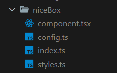

<p align="center">
  
</p>

# Overview

Ikota (Russian word for "hiccups", pronounced `/ikóta/`) is a CLI
automation tool for working with React. This plugin offers a
mantine preprocessor implementation for ikota.

# Install

```bash
$ npm i ikota @ikota/mantine
$ ikota config # or
$ npx ikota config
```

Follow prompt steps given by the ikota. After that you have to
add the following import to plugins array:

```js
const ikotaMantine = require("@ikota/mantine");

module.exports = {
  componentPath: "src/components",
  useTypescript: true,
  addConfigFile: true,
  addIndexFile: true,
  preprocessor: "mantine",
  useLambdaSimplifier: true, // Won't import useStyles if set to true
  trailingSpace: true,
  plugins: [ikotaMantine],
  other: {
    styleProps: true // Use inline props?
  }
}
```

# Usage

To generate the component you can use the configuration given
above or override the preprocessor set by the config using `-P`
flag:

```bash
$ ikota component -P mantine
```

> **Note**: Make sure to add plugin in the plugins array of the
config, otherwise it would throw an error.

## Example

<p align="center">
  
</p>

# Contributing

Pull requests are welcome. For major changes, please open an issue
first to discuss what you would like to change.

# License

This project is under [MIT](https://choosealicense.com/licenses/mit/)
license. You can freely use it for your own purposes.
